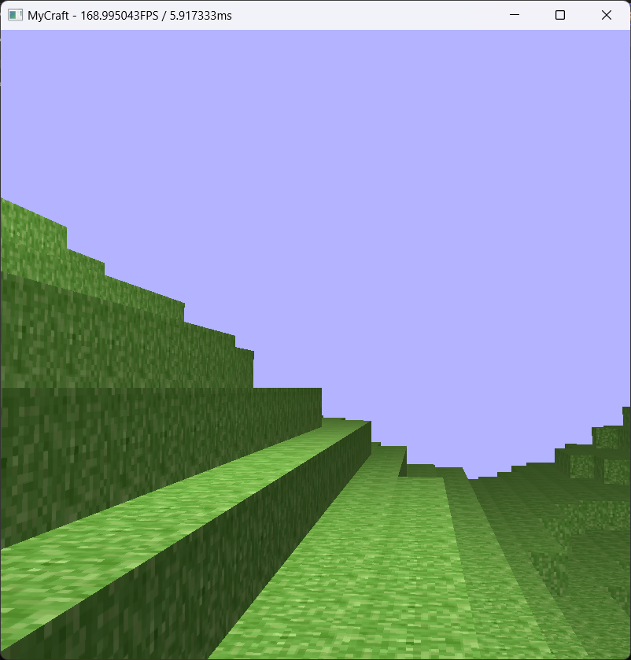

<!-- PROJECT LOGO 
 

  
-->

<h3 align="center">myCraft</h3>

  

    Minecraft style game built using C++ and OpenGL
     

<!-- TABLE OF CONTENTS -->

  
Table of Contents

  <ol>
    <li>
      <a href="#about-the-project">About The Project</a>
      <ul>
        <li><a href="#built-with">Built With</a></li>
      </ul>
    </li>
    <li>
      <a href="#getting-started">Getting Started</a>
    </li>
    <li>
      <a href="#patch-notes">Patch Notes</a>
    </li>
    <li><a href="#contact">Contact</a></li>
  </ol>

<!-- ABOUT THE PROJECT -->
## About The Project

This is an ongoing personal learning project to help us familiarize ourselves with GPU API's such as OpenGL and continue to further our skill as game developers.

The game is a Minecraft style, procedurally generated voxel sandbox.

(<a href="#readme-top">back to top</a>)

### Built With

(<a href="#readme-top">back to top</a>)

<!-- GETTING STARTED -->
## Getting Started

To try it out, please download, extract, and run myCraft.exe located in the zip file in the google drive folder below:
https://drive.google.com/drive/folders/1IDa2FCzghfAotbLsF4xUDhqKfRIdcPF5?usp=sharing

The basic control layout is:

W, A, S, D - Forward, Left, Backwards, Right

SPACEBAR - Jump

Hold Leftclick - Rotate player camera

(<a href="#readme-top">back to top</a>)

<!-- PATCH NOTES -->
## Patch Notes

 0.1 [LATEST PATCH] 

### Release Patch!

Hi! Here is some stuff we added.

## Basic Procedural Generation via Simplex Noise
- Map is generated in chunks, 32 x 32 x 32 blocks in size.
- The blocks in each chunk are all drawn as one mesh to reduce the number of draw calls sent to the GPU per frame. I started by rendering each block as an individual mesh, and this caused SIGNIFICANT performance issues. By switching to rendering chunks, performance has greatly increased, as we are only sending 9 draw calls, as only 9 chunks are ever loaded at the same time.

## General Collision Detection using Swept AABB
- Initially started with basic AABB for collision detection but could not create smooth 3D collision reactions with so many different possible collision objects in the gamespace.
- Swept AABB instead calculates the future position of an entity and sees if it collides with any block. If it does, it stops the object just before touching the block. This greatly reduces clipping and allows our reactions to be more seamless.

## [EXPERIMENTAL] Block Destruction
- Player can press P to cast a ray; if the ray finds a block, that block is deleted.
- Very janky right now, as while the ray casting works well, the way we get the possible blocks for the ray to collide with is by getting all loaded blocks and checking if the ray collides with each one. There is currently no check to see which block the ray should remove in the list of blocks, so it removes the first one it finds in the list. This means it will not necessarily remove the block that the player intends to remove but rather the first block along the ray that it encounters within the list of all blocks. So it could remove a block on the far side of the hill, instead of the block the player is staring at.

  

(<a href="#readme-top">back to top</a>)

<!-- CONTACT -->
## Contact
Feel free to contact us at:

@Kevin Chen - kevinz.chen@mail.utoronto.ca\
@Joshua Luo - jla818@sfu.ca

(<a href="#readme-top">back to top</a>)

